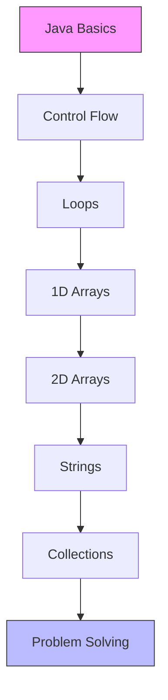

# 🚀 Java Competitive Programming Learning Path

A comprehensive collection of Java programming concepts and practice problems for competitive programming and coding interviews.

## 📋 Table of Contents
- [Prerequisites](#-prerequisites)
- [Repository Structure](#-repository-structure)
- [Learning Path](#-learning-path)
- [Getting Started](#-getting-started)
- [Contributing](#-contributing)
- [License](#-license)

## 🎯 Prerequisites
- Java Development Kit (JDK) 8 or higher
- A Java IDE (IntelliJ IDEA, Eclipse, or VS Code with Java extensions)
- Basic understanding of programming concepts

## 📁 Repository Structure
```
CPJavaLearning/
├── Introduction_to_Problem_Solving/  # Basic problem-solving approaches
├── Refresher_1D_Array/               # 1D Array problems and examples
├── Refresher_2D_Arrays/              # 2D Array problems and examples
├── Refresher_ArrayList/              # ArrayList implementations
├── Refresher_For_Loop/               # For loop exercises
├── Refresher_Functions/              # Function implementations
├── Refresher_HashSet_HashMap/        # Collections framework
├── Refresher_Introduction_Java_Input_DataTypes_Operators/  # Java basics
├── Refresher_Introduction_to_Java_If_Else/  # Control flow
├── Refresher_Patterns/               # Pattern printing problems
├── Refresher_Strings/                # String manipulation
└── Refresher_While_Loop/             # While loop exercises
```

## 🛣️ Learning Path



## 🚀 Getting Started
1. Clone the repository:
   ```bash
   git clone https://github.com/yourusername/CPJavaLearning.git
   ```
2. Open the project in your preferred Java IDE
3. Navigate to the specific concept you want to learn
4. Run the examples and practice the exercises

## 🤝 Contributing
Contributions are welcome! Please feel free to submit a Pull Request.

## 📝 License
This project is licensed under the MIT License - see the [LICENSE](LICENSE) file for details.
